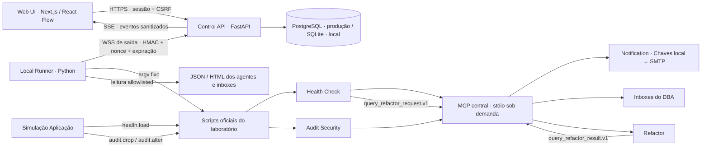

# Agent Monitoring DB · Lab Console

> Guia atual de instalação: README.md da raiz e docs/SETUP.md.
> Nos exemplos abaixo, defina `AGENT_MONITORING_ROOT="$(pwd)"` na raiz do clone.

Cockpit web para entender e operar o laboratório sem mover nem reimplementar os agentes. Canvas escuro com Health Check, Audit, MCP, Notification, DBA e Refactor; eventos ao vivo; relatórios HTML; chat operacional e aprovação de consultas catalogadas.

**Comece pelo modo demo.** Ele não conecta runner, MySQL, MCP real nem SMTP. O modo integrado é uma configuração separada do servidor, não um toggle no navegador.

## Retomar sem o histórico da conversa

Última revisão de continuidade: **24/09/2026**. Este README é o ponto de entrada para o DBA, Codex ou outro desenvolvedor. Não é necessário recuperar o chat para entender o projeto. Código, configuração não secreta e estado atual prevalecem sobre o registro histórico abaixo.

1. Leia as instruções da raiz [AGENTS.md](../../AGENTS.md), [MEMORY.md](../../MEMORY.md) e [handoffs](../../docs/handoffs.md), respeitando o escopo do agente que retomar a tarefa.
2. Leia este arquivo e [OPERACAO.md](docs/OPERACAO.md), [CONTRATOS.md](docs/CONTRATOS.md) e [VALIDACAO.md](docs/VALIDACAO.md).
3. Antes de alterar a Web, leia também [web/AGENTS.md](web/AGENTS.md) e a documentação local do Next indicada nele. Preserve alterações existentes e não modifique agentes, scripts oficiais ou credenciais para fazer a demo funcionar.
4. Confira as portas e o modo atual antes de subir serviços. Não inicie uma segunda API nem encerre um processo desconhecido só porque ocupa a porta.

```sh
lsof -nP -iTCP:3000 -sTCP:LISTEN
lsof -nP -iTCP:8000 -sTCP:LISTEN
curl --fail --silent --show-error http://localhost:8000/api/health
```

O último endpoint informa o **modo da API**, não a saúde do banco ou a entrega de e-mail. Se não responder, isso não prova falha dos agentes: a demo pode simplesmente estar desligada.

### Estado entregue e decisões que devem ser preservadas

- App implementado em `apps/lab-console/`, separado dos agentes existentes; versão de API/pacote `0.1.0`.
- Canvas com sete blocos — Health, Audit, Simulação Aplicação, MCP, Notification, DBA e Refactor — além de controles, timeline, histórico de jobs, biblioteca JSON/HTML e chat DBA.
- Não há tela de login, senha de aprovação ou seleção de usuário. Acesso local automático como `local-dba`, com papel `dba_approver`, autorizado pelo DBA em 17/09/2026. Isso **não identifica a pessoa** que opera a máquina.
- Confirmação digitada `sakila`, aprovação em duas etapas, CSRF, allowlist de ações e chave do runner continuam obrigatórios onde aplicáveis. Retirar login não autorizou SQL livre nem publicação pública.
- A matriz atual de testes, execuções reais e limitações está em
  `docs/VALIDACAO.md`; não reutilize contagens antigas como evidência da
  versão atual.
- A validação integrada de 23/09/2026 comprovou Health Check, Audit, MCP,
  Notification, DBA e Refactor de ponta a ponta. DROP e ALTER foram negados
  pela conta restrita e nenhuma mutação foi aplicada.
- Docker, PostgreSQL real e deployment público não foram homologados. O chat
  contextual usa o analisador Codex configurado e o Refactor processa somente
  solicitações versionadas no laboratório `sakila_dev`.

Uma demo pode estar ativa em um runtime temporário de validação, mas isso não é garantia de processo vivo. `/private/tmp` pode ser limpo pelo sistema; para preservar metadados da demo, use o runtime padrão dentro do app. Nunca dependa de IDs de sessão do chat para reiniciar o projeto.

### Stack implementada

| Camada | Tecnologia e função |
|---|---|
| Web | Next.js 16, React 19 e TypeScript; build standalone |
| Canvas e estado | React Flow 12; TanStack Query 5, snapshot e eventos SSE |
| Interface | Tailwind CSS 4, componentes Radix UI, ícones Lucide |
| API | Python 3.11+, FastAPI, Pydantic e Uvicorn |
| Persistência | SQLAlchemy; SQLite local e suporte a PostgreSQL via psycopg |
| Runner | Python, WebSocket assinado, subprocessos com argv fixo, psutil e watchdog |
| Qualidade | pytest, Ruff, mypy, ESLint, Prettier, TypeScript, Playwright e axe |

As versões resolvidas estão nos lockfiles, não nesta tabela. Não atualize dependências como requisito para simplesmente retomar a demo.

## Abrir a demo

Requisitos: Python 3.11+, `uv`, Node.js 22.14+ e npm. Dependências travadas em `uv.lock` e `package-lock.json`.

```sh
cd "${AGENT_MONITORING_ROOT}/apps/lab-console/api"
uv sync --frozen --extra dev --cache-dir /private/tmp/mysqlconf-lab-uv-cache
cd ../web
npm ci --cache /private/tmp/mysqlconf-lab-npm-cache
cd ..
python3 scripts/dev.py
```

Abra **http://localhost:3000**: entrada direta no canvas, sem login. Por autorização explícita do DBA, demo e integrado local usam o operador único `local-dba`, sem senha. Cookie e CSRF continuam ativos; autenticação do runner não mudou. O integrado rejeita origem pública e requisições HTTP não locais. Não exponha esta versão na internet. O script usa SQLite isolado e encerra UI/API com Ctrl-C.

Com a atividade ao vivo vazia, clique em **Começar demonstração**, confira a explicação e digite `sakila`. Em demo, os três e-mails são simulados. Abra a biblioteca para consultar os três HTMLs fictícios. No chat, experimente “qual é o cooldown?” e, em **Propor ação**, “contar atores”. A aprovação continua em uma segunda etapa, com alvo digitado, mas sem senha.

Para testar o build otimizado:

```sh
cd web
npm run build
cd ..
python3 scripts/dev.py --production
```

Use `--runtime /caminho/novo` para uma sessão de demonstração limpa, sem apagar execuções anteriores. Os eventos ficam no SQLite dessa pasta; os HTMLs fictícios são efêmeros e desaparecem ao reiniciar a API.

`--production` significa **servir o build otimizado da Web**, não conectar sozinho ao banco de produção. Sem `--integrated`, `scripts/dev.py` força `LAB_MODE=demo`, remove configurações integradas herdadas e não inicia runner. O atalho operacional local é `python3 scripts/dev.py --production --integrated --allow-execute`: ele liga API, build Web e runner allowlisted em loopback; nenhuma ação de banco começa até o clique e a confirmação `sakila`.

### Roteiro de conferência manual da demo

1. Abrir o canvas diretamente, sem formulário de login; conferir o selo de demonstração.
2. Ativar apenas o Health e confirmar que ele permanece executando até **Parar** e que somente Health → MCP fica animado. O botão **Executar SELECTs** do bloco Simulações é liberado; DROP/ALTER continuam bloqueados.
3. Ativar o Audit: Audit → MCP também anima e os botões **Tentar DROP** e **Tentar ALTER** são liberados. Parar um agente apaga somente a linha dele e volta a bloquear seus cenários.
4. No bloco **Simulação Aplicação**, disparar individualmente SELECTs, DROP ou ALTER. A ação SELECT inicia a carga de latência e a geração contínua de entradas no Slow Query Log até `Cancelar`. Cada ação pede `sakila`; na demo, os eventos e e-mails são fictícios.
5. Com a atividade ao vivo vazia, usar **Começar demonstração** para orquestrar os três cenários juntos e observar `query_latency`, `destructive_ddl` e `schema_change` até MCP → Notification / DBA.
6. Abrir a biblioteca e conferir a evidência correspondente ao alerta, incluindo HTML quando disponível. Conteúdo da demo é fictício, não relatório atual do MySQL.
7. No chat, perguntar sobre cooldown; depois propor “contar atores”, revisar a proposta, digitar o alvo na aprovação e conferir o resultado simulado. Não há campo de senha.
8. Conferir jobs e timeline; ao terminar, usar Ctrl-C no terminal que iniciou `scripts/dev.py`. Fechar a aba não equivale a parar serviços.

## Arquitetura



O navegador nunca recebe credenciais MySQL/SMTP nem envia comandos shell. A API não abre conexões com MySQL. O runner traduz action IDs fixos e reutiliza os scripts existentes, inclusive suas configurações e gates. MCP e Notification **não são daemons a iniciar pelo canvas**: executam sob demanda no fluxo oficial. O status “Sob demanda” não é uma afirmação de conectividade SMTP.

`Ativar Health` executa `run-health-check-lab.py --monitor-only --execute`: monitor e advisor permanecem ativos até parada explícita. O Health Check monitora o Slow Query Log e pode registrar solicitações no MCP, mas não inicia o worker do Refactor. Somente `Ativar Refactor` consome as solicitações pendentes. `Executar SELECTs` chama `run-health-select-simulation.py`: primeiro há um aquecimento read-only de 60 segundos a 1 TPS e um worker; somente após essa etapa a carga de latência existente e `run-slow-query-log-demo.py` são iniciados em paralelo. O segundo script lê a SQL original do catálogo versionado, executa-a sequencialmente sem timeout artificial e gera novas entradas no Slow Query Log enquanto o job estiver ativo. A UI mostra a fase e o tempo de parede e troca o botão para **Cancelar**; o runner encerra toda a árvore de processos. DROP e ALTER usam o mesmo ciclo de job/cancelamento com seus wrappers Python protegidos, embora normalmente terminem mais rápido. A UI nunca aceita caminho, argumento ou SQL livre.

O diagrama descreve o caminho integrado; na demo, `demo.py` substitui as execuções e evidências por simulação. O transporte local usa HTTP/WS loopback; HTTPS/WSS remoto não significa que publicação pública esteja autorizada ou implementada para a UI sem login.

### Organização

```text
apps/lab-console/
├── web/                  Next.js, componentes, estilos, testes Playwright
├── api/
│   ├── labconsole/       API, runner, segurança, catálogo, demo e watchdog
│   ├── migrations/       schema inicial aditivo
│   └── tests/            unitários e integração HTTP + WSS local com fakes
├── scripts/
│   ├── dev.py             inicialização local da Web, API e runner
│   ├── run-health-check-lab.py
│   ├── run-audit-lab.py
│   ├── run-audit-drop-lab.py
│   └── run-audit-alter-lab.py
├── docs/                 operação, contratos, decisões e evidência de validação
├── compose.yaml          Web + API + PostgreSQL; runner fica no host
└── .env.example          somente referências e valores fictícios
```

### Mapa para manutenção

| Arquivo | Onde atuar / responsabilidade |
|---|---|
| `web/src/components/console.tsx` | Sessão automática, navegação, dados, controles e confirmações |
| `web/src/components/canvas.tsx` | Blocos, conexões e enquadramento do canvas |
| `web/src/components/dba-chat.tsx` | Central de ocorrências, resumo factual e perguntas sobre os arquivos recebidos |
| `web/src/components/artifact-viewer.tsx` | Biblioteca e visualização isolada de evidências |
| `web/src/lib/api.ts` | Tipos compartilhados pelo cliente e chamadas HTTP |
| `web/src/app/globals.css` | Identidade visual e layout |
| `web/next.config.ts`, `web/start.mjs` | Proxy `/api`, headers e startup standalone |
| `api/labconsole/app.py` | Rotas, sessões, jobs, eventos, aprovações e conexão do runner |
| `api/labconsole/models.py` | Contratos de entrada, eventos e catálogo de ações/recursos |
| `api/labconsole/runner.py` | Tradução de ações para executores, correlação e controle de processos |
| `api/labconsole/guardian.py` | Watchdog dos processos iniciados pelo runner |
| `api/labconsole/artifacts.py` | Catálogo e leitura segura de JSON/HTML existentes |
| `api/labconsole/incident_analysis.py` | Leitura das inboxes DBA, mascaramento e resumo factual pelo Luna |
| `api/labconsole/security.py` | Assinaturas, sanitização e compatibilidade de autenticação legada |
| `api/labconsole/store.py` | Metadados persistidos, versão de schema e retenção |
| `api/labconsole/demo.py` | Eventos, resultados e relatórios fictícios |
| `api/labconsole/notification_probe.py`, `notification_dispatch.py` | Adaptação do teste Notification aos entrypoints existentes |
| `api/tests/`, `web/tests/console.spec.ts` | Regressões da API/runner e fluxo de navegador |

Não editar `node_modules/`, `.next/`, `.venv/`, `dist/` ou relatórios gerados para corrigir código-fonte. Os relatórios reais continuam pertencendo aos agentes; o app não deve substituir um HTML ausente pelo latest de outra coleta.

### Configuração e dados

| Opção | Uso |
|---|---|
| `LAB_MODE` | `demo` por padrão; `integrated` é escolha do processo da API |
| `LAB_ORIGIN` | Origem exata do navegador; normalmente `http://localhost:3000` |
| `LAB_API_URL` | Destino do proxy Next; padrão `http://127.0.0.1:8000`; fixado no build |
| `LAB_RUNTIME` | Pasta de runtime da API; o launcher define uma pasta absoluta |
| `LAB_DATABASE_URL` | Banco de metadados; se ausente, SQLite `console.db` no runtime |
| `LAB_RETENTION_DAYS` | Retenção de eventos/propostas, aplicada no startup; padrão 14 |
| `LAB_RUNNER_KEY` | Segredo operacional exigido no integrado; mínimo 32 caracteres; nunca gravar no README |
| `AGENT_MONITORING_CONFIG` | Caminho opcional do TOML central; perfis e TLS são resolvidos pelo mesmo módulo em todos os agentes |
| `LAB_E2E_URL`, `LAB_BROWSER_CHANNEL` | Destino **demo** e navegador da suíte Playwright |

`.env.example` é referência; o launcher Python não carrega automaticamente um arquivo `.env`. No integrado, injete as variáveis pelo ambiente do serviço. `LAB_USERS_JSON` e `lab-password` são compatibilidade legada, não requisitos para abrir a interface e não restauram uma barreira de login enquanto `/api/access` estiver ativo.

Persistem no banco do app: jobs, eventos, propostas e versão de schema. Sessões, nonces, conexão do runner e controles em memória não sobrevivem ao reinício da API. HTMLs da demo são efêmeros; HTMLs reais são consultados na origem. Para continuidade, preserve o banco de metadados com backup apropriado ao banco utilizado; não apague runtime para corrigir um erro. Para testes limpos, escolha uma pasta nova.

## Modo integrado — configuração e validação local

1. Leia [operação e segurança](docs/OPERACAO.md). Mantenha uma única instância/worker da API.
2. Não configure usuários ou senhas para a UI. Quem acessar localmente terá o papel DBA; use somente em uma máquina de confiança e mantenha os serviços ligados a `127.0.0.1`, sem exposição à rede, proxy público ou túnel.
3. Configure `LAB_MODE=integrated`, `LAB_ORIGIN=http://localhost:3000`, `LAB_DATABASE_URL` e uma chave aleatória `LAB_RUNNER_KEY` com pelo menos 32 caracteres na API e no runner. Não reutilize os valores de teste.
4. Inicie a API com o comando abaixo. `LAB_*` deve estar previamente injetado pelo ambiente, não hardcoded no código.

```sh
cd "${AGENT_MONITORING_ROOT}/apps/lab-console/api"
.venv/bin/uvicorn labconsole.app:create_app --factory --host 127.0.0.1 --port 8000 --workers 1
```

5. Inicie o runner **sem permissão de execução**, para validar planos:

```sh
cd "${AGENT_MONITORING_ROOT}/apps/lab-console/api"
.venv/bin/lab-runner \
  --repository "${AGENT_MONITORING_ROOT}" \
  --runtime "${AGENT_MONITORING_ROOT}/apps/lab-console/runtime/runner" \
  --url ws://127.0.0.1:8000/runner \
  --actions health.lab,health.load,health.collect,audit.lab,audit.drop,audit.alter,lab.three,notification.test
```

`ws://127.0.0.1:8000/runner` só é permitido para desenvolvimento local. Qualquer destino remoto exige WSS. Não abra porta pública na máquina do MySQL.

6. **Somente após autorização do DBA**, reinicie o mesmo runner acrescentando `--allow-execute`. Cada execução ainda exige confirmação na UI. Ative Health antes de SELECTs e Audit antes de DROP/ALTER. As tentativas DDL continuam subordinadas ao monitor pronto e à conta restrita dos scripts oficiais. Não é possível fornecer outro SQL/argv pelo navegador.

7. Consultas do chat exigem também as actions `dba.actor_count,dba.film_count` no escopo e o perfil `monitoring_login_path` configurado no TOML central para uma conta de somente leitura. A aplicação não cria credenciais.

8. Para abrir cada serviço manualmente, em outro terminal dentro de `web/`, use `LAB_API_URL=http://127.0.0.1:8000 npm run build` e depois `npm start`. Para o laboratório local simples, o atalho equivalente é `python3 scripts/dev.py --production --integrated --allow-execute`; ele gera uma chave efêmera de runner quando nenhuma foi injetada. Confirme `{"status":"ok","mode":"integrated"}` em `/api/health` antes de qualquer ação real.

## Publicação online e Docker

Os Dockerfiles estão preparados. O runner permanece no macOS/host do laboratório para usar o perfil MySQL e o Chaves existentes. **Docker/Compose não foram executados nesta máquina, pois Docker não está instalado. Não há deployment público realizado.**

Configure variáveis com base em `.env.example`, substituindo os valores fictícios. Depois:

```sh
cd "${AGENT_MONITORING_ROOT}/apps/lab-console"
docker compose config
docker compose up --build
```

O Compose publica somente `127.0.0.1:3000` e `127.0.0.1:8000` e permanece uma opção para a demo. O integrado sem login exige HTTP loopback e deve rodar nativamente no host; requests vindos de outro container são rejeitados. Não publique o integrado online nem exponha PostgreSQL. Publicação pública exige nova decisão de controle de acesso, fora desta autorização.

No build da Web fora do Compose, configure `LAB_API_URL=http://127.0.0.1:8000` antes de `npm run build`; os rewrites são fixados no build. Use `LAB_ORIGIN=http://localhost:3000`. Defina backups, monitoramento e rotação da chave do runner antes de uso contínuo.

## Validação

Durante um ajuste pequeno, use a trilha rápida relacionada à mudança:

```sh
cd api
.venv/bin/pytest -q -m "not integration"
cd ../web
npm run lint
npm run typecheck
npm run test:agents  # requer a demo local já iniciada
```

`test:agents` cobre especificamente a permanência de Health/Audit e as linhas animadas independentes. A trilha Python rápida omite somente testes que abrem HTTP/WebSocket ou processos reais locais; ela não substitui a validação completa antes de entregar.

Para a validação completa:

```sh
cd api
.venv/bin/ruff check labconsole tests ../scripts
.venv/bin/ruff format --check labconsole tests ../scripts
.venv/bin/mypy
.venv/bin/pytest -q
uv build --cache-dir /private/tmp/mysqlconf-lab-uv-cache
cd ../web
npm run lint
npm run format:check
npm run typecheck
npm run build
```

Para os testes de navegador, inicie uma demo com runtime novo em outro terminal e execute `npm test` em `web/`. A suíte usa Chrome instalado; para outro ambiente, instale Chromium pelo Playwright e use `LAB_BROWSER_CHANNEL=chromium npm test`. Os cenários usam uma sessão de demonstração inicialmente vazia e rodam sequencialmente. Nenhum teste automatizado usa MySQL, MCP ou e-mail reais.

Resultados, screenshots e limitações: [VALIDACAO.md](docs/VALIDACAO.md). Catálogo de ações e eventos: [CONTRATOS.md](docs/CONTRATOS.md).

## Diagnóstico rápido e próximos passos

| Sintoma | Conferência segura |
|---|---|
| Porta ocupada | Identificar o processo com `lsof`; reutilizar a instância correta ou pedir ao responsável para encerrá-la |
| UI sem conectar à API | Verificar `/api/health`, portas e `LAB_API_URL`; mudança do destino exige novo build |
| Erro de Origin/CSRF | Usar exatamente `http://localhost:3000`, conforme `LAB_ORIGIN`, e recarregar; não desabilitar a proteção |
| Integrado retorna `local_access_required` | Conferir loopback e Host; container/proxy externo não é caminho suportado sem login |
| Runner offline | Conferir processo, URL, chave correspondente e escopo; não habilitar execução para diagnosticar conexão |
| DROP/ALTER desabilitados | Monitor Audit precisa estar pronto; não contornar esse gate |
| HTML indisponível | Conferir identidade da coleta, retenção e filtros; histórico Audit pode ter somente JSON |
| E2E encontra contagens anteriores | Parar a demo de teste de forma controlada e usar outro runtime vazio; nunca apagar evidências reais |

Próximo passo operacional, **somente quando solicitado e autorizado**, é revisar os planos do integrado local com runner sem execução e depois homologar os três cenários reais, verificando separadamente MCP, e-mail e registro DBA. Docker/PostgreSQL são gates adicionais se essa forma de implantação for escolhida. Publicação na internet exige uma nova decisão de segurança, pois a decisão vigente é não ter login e operar localmente. Ampliação para LLM ou SQL livre não faz parte do escopo entregue.

Ao concluir uma mudança, atualize este README e `docs/VALIDACAO.md` com data, testes realmente executados e limitações. Não transforme resultados históricos em comprovação de uma nova versão.

### Texto pronto para iniciar outra conversa

```text
Retome o app ${AGENT_MONITORING_ROOT}/apps/lab-console.
Leia o README.md completo e os documentos OPERACAO.md, CONTRATOS.md e
VALIDACAO.md em docs/, respeitando os AGENTS.md aplicáveis.
O app já existe: não recrie nem substitua os agentes oficiais.
Preserve entrada direta sem login no modo local, confirmação sakila,
allowlist de ações, isolamento de relatórios e autenticação do runner.
Comece conferindo código e estado atual; use demo para desenvolvimento.
Não execute carga, MySQL, MCP ou SMTP reais nem publique na internet
sem uma tarefa específica e autorização atual do DBA.
Explique o estado encontrado antes de implementar a próxima solicitação.
```

## Escopo desta versão

- A Central de ocorrências usa o Luna somente para resumir automaticamente novas ocorrências recebidas nas inboxes do DBA enquanto a API integrada está ativa. Abrir uma ocorrência apenas lê o resumo salvo e nunca dispara o modelo. Ela não consulta o banco, não busca causa raiz, não recomenda melhorias e não apresenta a antiga aba de proposta de ação.
- Refactor está representado no fluxo, mas os relatórios existentes são Markdown e não há contrato HTML/JSON compatível liberado no catálogo. A biblioteca permanece vazia para ele; nenhum documento potencialmente sensível é publicado automaticamente.
- O teste Notification usa o entrypoint manual existente para dry-run e o runtime público `notification.runtime.build_dispatcher` para envio, com dois gates (`--send` e delivery habilitado). O runtime resolve a senha no Chaves dentro do processo Notification. No modo integrado pode enviar **um e-mail real**, somente após confirmação; não fabrica registro MCP/DBA desse teste direto.
- O orquestrador dos três alertas exige confirmações independentes de MCP, Notification e DBA. Ele encerra Health após a primeira confirmação de envio e encerra o conjunto quando os três fluxos estão completos. Não é garantia matemática de exactly-once externo: uma entrega já em trânsito não pode ser desfeita.
- Catálogo de evidências é fail-closed: bloqueia arquivos com indicadores sensíveis, caminhos/links não permitidos e HTML que não corresponda a `audit_id` + timestamp. Não altera retenção dos agentes nem inventa HTML histórico do Audit.
- Regras exibidas são a política documentada atual (P99 2s/30s e cooldown 120s), não edição online de configuração. Jobs, controles, propostas e relatórios respeitam as limitações detalhadas em [OPERACAO.md](docs/OPERACAO.md).
